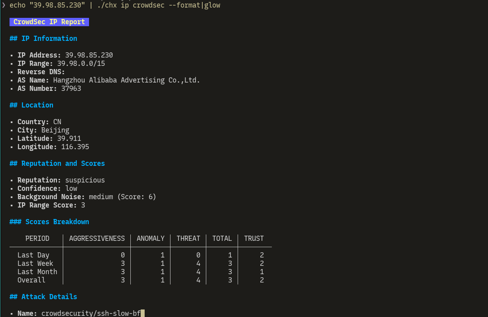

# 🛠️ CHX

## 📘 Introduction

CHX is a Golang based CLI for domain research, file hashes, IP analysis, and other functions. The project includes various commands and integrates with different sources like VirusTotal and CrowdSec.

## 📑 Table of Contents

- [📘 Introduction](#📘-introduction)
- [⚙️ Installation](#⚙️-installation)
- [📝 Usage](#📝-usage)
- [✨ Features](#✨-features)
- [📦 Dependencies](#📦-dependencies)
- [🛠️ Configuration](#🛠️-configuration)
- [📚 Documentation](#📚-documentation)
- [💡 Examples](#💡-examples)
- [🔧 Troubleshooting](#🔧-troubleshooting)
- [👥 Contributors](#👥-contributors)
- [📜 License](#📜-license)

## ⚙️ Installation

To install CHX, ensure you have Go installed on your machine and run the following commands:

```sh
go install github.com/EpykLab/chx@latest
```

Prebuilt binaries are also available under releases.

## 📝 Usage

After installing the project, you can use the CHX command-line tool as follows:

```sh
chx <command> [options]
```

### Example Commands

- `chx domain alienvault <domain-name>`
- `chx hash [alientvault, vthash] <hash>`
- `chx ip  [aipdb, alienvault, crowdsec] <ip-address>`

## ✨ Features

- 🌐 Domain analysis
- 🔑 File hashing
- 📡 IP address lookup
- 🔗 Integration with VirusTotal, CrowdSec, AlientVault, and AbuseIPDB
- ⚙️ Configurable via JSON
- 🖥️ Can take input as argument or stdin

## 📦 Dependencies

- 🐹 Go (version 1.18 or higher)
- 🌐 External APIs for certain functionalities (e.g., VirusTotal, CrowdSec)

## 🛠️ Configuration

Configuration is managed through a json file. The config file is stored in `$HOME/.config/chx/conf.json`.

To configure chx, use `chx config`.


### 🌐 Domain Analysis

```sh
chx domain alientvault example.com

```


### 🔑 File Hashing

```sh
chx hash vthash <hash>
```

Chx can work with pipes to take hash values from standard input. In order to be as unix friendly as
possible, chx also outputs to stdout so that output can be piped into other tools.


### 📡 IP Lookup

```sh
chx ip crowdsec 8.8.8.8
```
Basic IP lookups (uses alientvault)


### Pretty Print Results

All commands how implement a `--format` option that will format the results of a search into markdown format.



## 🔧 Troubleshooting

If you encounter any issues, please check the following:

- Ensure you have the correct API keys in your configuration file.
- Verify your internet connection for API integrations.
- Refer to the logs for any error messages.

## 👥 Contributors

- [David Hoenisch](https://github.com/DavidHoenisch)

## 📜 License
MIT

## 📣 Release Announcments
Follow  our Telegram channel to stay up to date with the latest news and tool releases from EpykLab!


